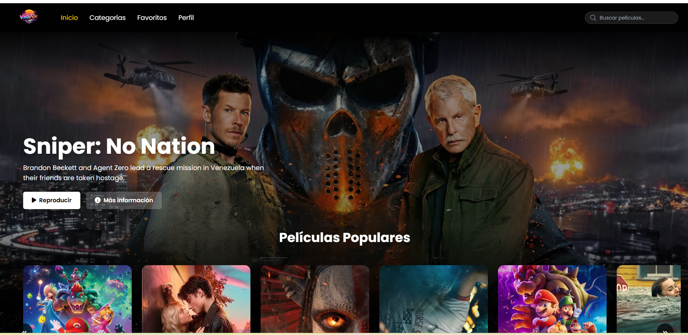
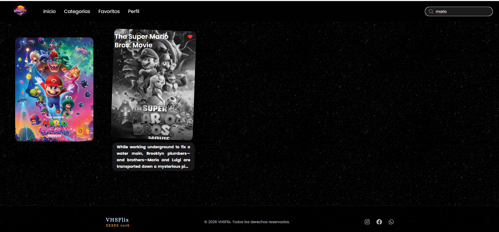
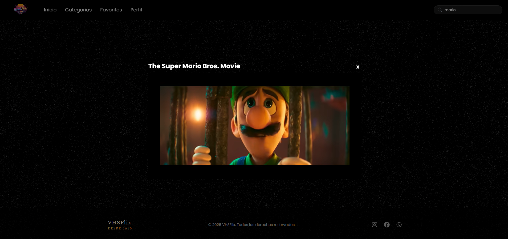
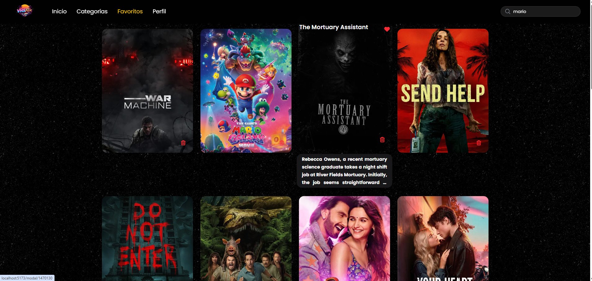

🎬 VHSFlix - React Movie App

A Netflix-style web application built with React that allows users to explore movies, watch trailers, and manage favorites.

This project is focused on demonstrating real frontend development skills, API consumption, and global state management.

🎥 Demo

👉 https://youtu.be/6uShkUgO-Bw

## 📸 Vista previa

### 🏠 Home

### 🔍 Búsqueda

### 🎬 Trailer

### ❤️ Favoritos

🛠️ Technologies Used
React + Vite
JavaScript (ES6+)
Tailwind CSS
Context API + useReducer
React Router
REST API (TMDB)
✨ Features
🔍 Real-time movie search
🎭 Category navigation (Action, Comedy, Horror, Animation…)
🎬 Trailer preview
❤️ Favorites system
🎞️ Netflix-style horizontal scroll
📱 Responsive design
🧩 Architecture
Global state managed with Context API and useReducer
Reusable components
Separation of logic and presentation
External API consumption (TMDB)
Routing handled with React Router
📂 Project Structure

src/
│── components/
│── pages/
│── context/
│── assets/
│── App.jsx
│── main.jsx

⚙️ Installation & Usage

Clone the repository:

git clone https://github.com/YOUR-USERNAME/vhsflix.git

Install dependencies:

npm install

Run the project:

npm run dev

🔑 Configuration

Create a .env file in the root directory:

VITE_API_KEY=your_api_key_here

📈 Future Improvements
🔐 User authentication
💾 Persist favorites in a database
⭐ Rating system
🎥 Trailer autoplay on hover
📊 Personalized recommendations
👨‍💻 Author

Frontend developer in training, focused on React and modern web applications.

Currently looking for my first opportunity as a frontend developer.

📩 Contact:

GitHub: https://github.com/Danieldaviddf
GitHub: https://github.com/alexisrrh
Email: alexisrrh123@gmail.com
⭐ Note

This project is part of my learning journey, but it is built using real-world development practices.

